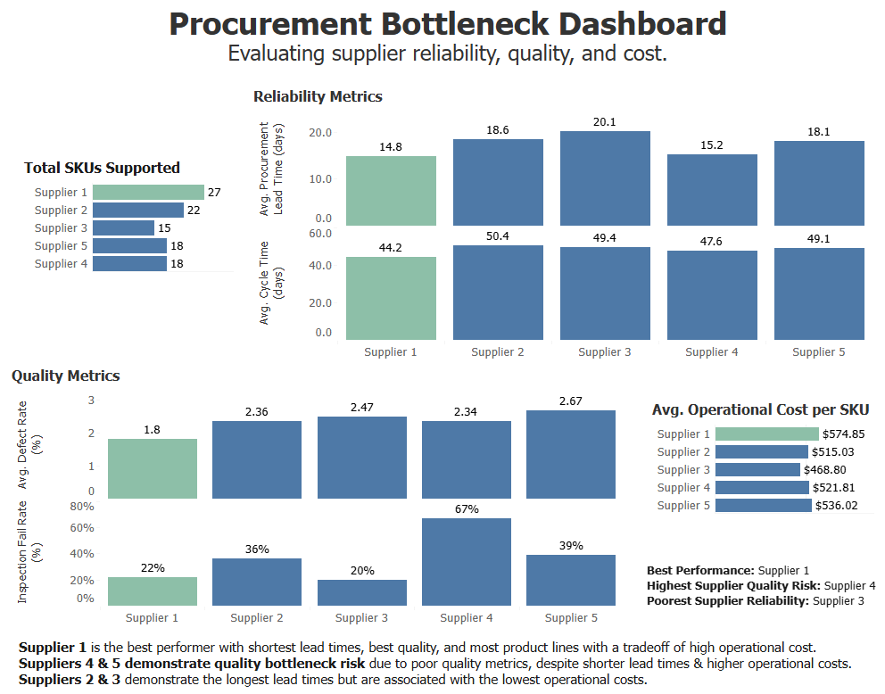
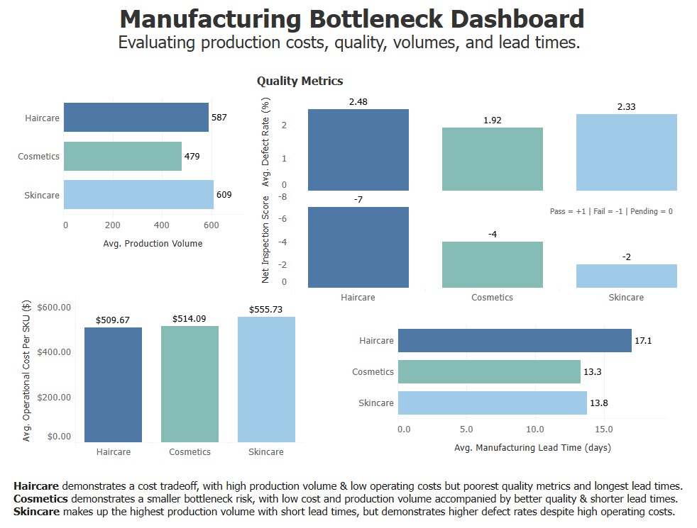
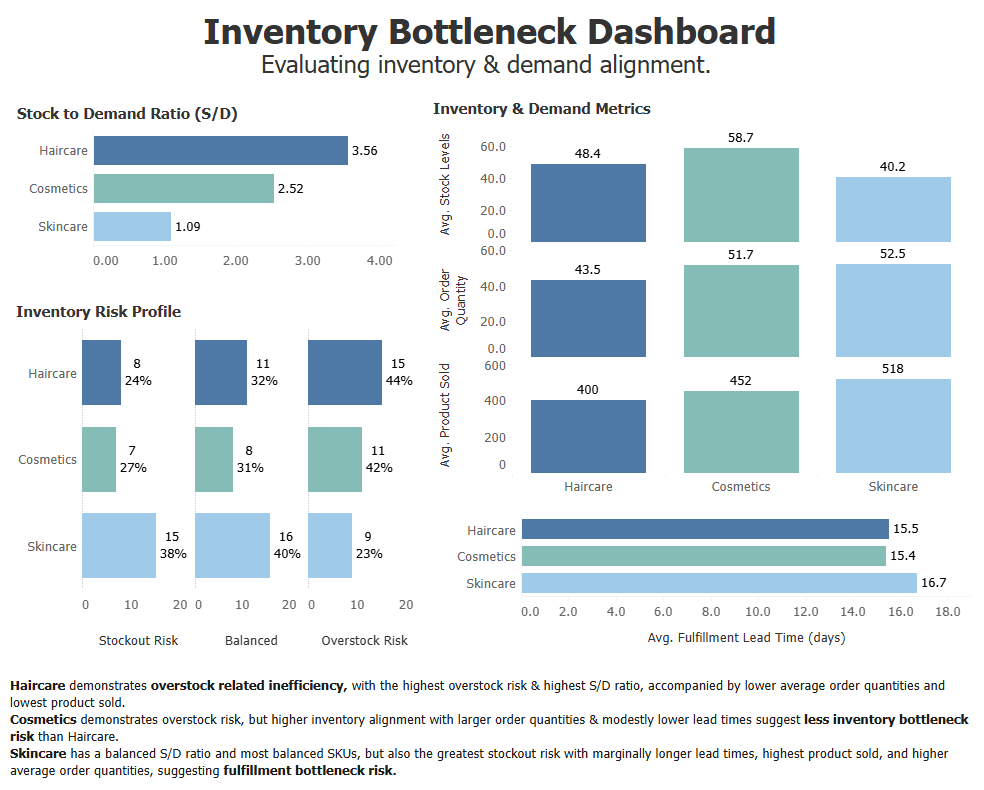
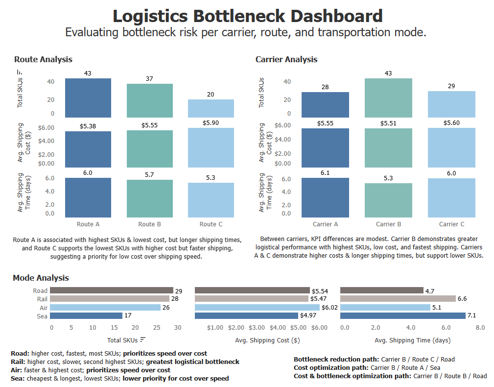

# Beauty Startup Supply Chain Bottleneck Analysis 

## Tableau Dashboards 
- [Procurement Dashboard](https://public.tableau.com/views/SupplyChainBottleneckAnalysis-ProcurementDashboard/Dashboard1?:language=en-US&:sid=&:redirect=auth&:display_count=n&:origin=viz_share_link) 
- [Manufacturing Dashboard](https://public.tableau.com/views/SupplyChainBottleneckAnalysis-ManufacturingDashboard/Dashboard1?:language=en-US&:sid=&:redirect=auth&:display_count=n&:origin=viz_share_link)
- [Inventory Dashboard](https://public.tableau.com/views/SupplyChainBottleneckAnalysis-InventoryDashboard/Dashboard1?:language=en-US&:sid=&:redirect=auth&:display_count=n&:origin=viz_share_link)
- [Logistics Dashboard](https://public.tableau.com/views/SupplyChainBottleneckAnalysis-LogisticsDashboard/Dashboard1?:language=en-US&:sid=&:redirect=auth&:display_count=n&:origin=viz_share_link)

## Overview 
This project analyzes a supply chain dataset from a beauty startup containing data on 100 product SKUs. The analysis was completed via SQL and was segmented into four phases of the supply chain, including procurement, production, inventory and order fulfillment, and logistics. Tableau was then used to create four key business insight dashboards for each phase. This project identified key operational bottlenecks within the supply chain and provides data driven insights and recommendations to improve operational efficiency and supply chain performance. 

## Business Problem
It is key for businesses to understand the performance of their supply chain in order to identify potential bottlenecks and areas of inefficiency. A streamlined, high performing supply chain can mean greater cost efficiency, consistent and reliable order fulfillment, improved quality and manufacturing reliability, and consistency in customer satisfaction, whereas a supply chain with operational constraints and poor performance can reduce a business’ ability to compete and succeed. This project seeks to support a beauty startup in better understanding of each phase of the supply chain and their respective potential bottlenecks in order to streamline and improve the performance of the overall supply chain. 

## Tools Used
- SQL (Google BigQuery)
- Tableau Public

## Dataset Description 
- Public beauty startup supply chain dataset from Kaggle. 
- Dataset contains supply chain data for 100 product SKUs and includes 24 data fields.
    - Key fields include product type, stock levels, lead times, costs, production volumes, suppliers, carriers, routes, transportation modes, and quality metrics. 
- Product SKUs span haircare, skincare and cosmetics and use five suppliers, three carriers, three routes, and five modes of transportation. 
- Dataset allows for end to end supply chain analysis. 
- Limitations:
    - Gaps in dataset context leading to need for interpretation of several fields. 
    - Public created dataset may contain inaccurate, incomplete or biased data.
    - Dataset did not contain several key fields needed for more complete analysis. 

## Process & Workflow
### Cleaning & Feature Engineering: 
- Cleaned and formatted the dataset using SQL.
    - Validated data for missing values, duplicates, consistency, and accuracy.
    - Developed data interpretations for fields as needed. 
        - Two “lead time” fields existed. Interpreted one as order fulfillment lead time and the other as procurement lead time.
        - Assumed “costs” field represented total operational costs per SKU for the entire supply chain.
        - Removed “availability” field as its meaning was ambiguous compared to “stock levels”.
        - Assumed that ‘order quantity’ represents the quantity of units requested, and used as a proxy demand metric. Average order quantity by product type represents the average number of units requested per SKU within each product type. 
- Created a final cleaned SQL view for use in analysis.
  - Removed data fields unneeded for analysis, including customer demographics, location, and availability.
  - Formatted values and standardized column naming.
  - Engineered KPIs for analysis including stock to demand ratio, SKU profit, cost to revenue ratio, first pass yield, cycle time, and manufacturing cost per unit.
    - Stock to demand ratio (S/D ratio) was calculated using stock levels and order quantity, and used to measure alignment of inventory with demand by examining the stock levels relative to the number of units ordered per SKU.
    -  Cycle time was calculated as the total of fulfillment, procurement and manufacturing lead times. 
  - Categorized data based on key metrics to create derived columns including stock risk status, SKU profitability, quality rating, and inspection score.
    - Stock risk status was created by evaluating the S/D ratio against ranges that represented overstock, stockout, or balanced stock to demand.
    - Inspection score was created by assigning inspection results to numerical values. 
### Analysis: 
- Conducted analysis in SQL on four key supply chain phases via grouped aggregations
  - Seven key SQL queries created for analysis, including procurement, manufacturing, inventory, and logistics by carrier, route and transportation mode.
- Generated clean data tables of key metrics and KPIs for each supply chain phase
### Visualization & Insight Generation: 
- Created four dashboards using Tableau to understand supply chain performance in each phase and potential bottlenecks and areas for improved efficiency and performance.
- Developed business recommendations based on key insights.
## Skills Demonstrated 
- SQL including CTEs, aggregation, views, string manipulation, and data categorization 
- Google BigQuery
- Tableau
- Data cleaning, validation, & transformation
- KPI and metrics development
- Data aggregation & analysis
- Dashboard development and design
- Data visualization
- Supply chain analytics
- Bottleneck analysis
- Operational performance analysis
- Inventory and demand analysis
- Business intelligence and insight generation
- Tradeoff analysis
- Data storytelling
  
## Dashboard Summaries
Four key dashboards were created in this analysis, one for each phase of the supply chain. Each dashboard illuminates potential bottlenecks and supply chain improvements for each respective phase. Put together, they clarify the overall supply chain function for the startup and ways to enhance efficiency and optimize performance for the business. 

### Procurement Dashboard
This dashboard analyzes key supplier performance metrics in order to identify potential procurement bottlenecks. 
Key KPIs include total SKUs supported by each supplier, procurement lead time and total supply chain cycle time, defect rate and inspection fail rate, and overall operational cost per SKU. 

 

### Manufacturing Dashboard 
This dashboard analyzes production metrics for each product type, including cost, quality and reliability, in order to identify potential operational bottlenecks. 
Key KPIs include production volume, defect rate and inspection score, overall operational cost, and manufacturing lead time. 

 

### Inventory Dashboard 
This dashboard analyzes inventory / demand and fulfillment metrics for each product type in order to identify potential inventory risk and misalignment leading to operational bottlenecks. 
Key KPIs include stock to demand ratio (S/D ratio), inventory risk profile metrics, stock levels, order quantities, product sold, and fulfillment lead time. 

 

### Logistics Dashboard 
This dashboard analyzes key logistics metrics by route, carrier and transportation mode in order to understand potential inefficiencies or tradeoffs in shipping. 
Key KPIs include total SKUs, shipping cost, and shipping time. 

 

## Key Insights
### Procurement 
- Supplier 1 stands out as the top performer with best reliability and quality metrics and the most product lines, with a tradeoff of high operational costs. 
- Suppliers 4 & 5 demonstrate greater quality risk and are associated with higher operational costs but stand out with shorter lead times. Suppliers 2 & 3 demonstrate the highest reliability risk but are associated with better quality and lower operational cost.
### Production
- Cosmetics demonstrates the lowest manufacturing bottleneck risk, with low operational costs, low production volume, short lead times, and good quality metrics. 
- Haircare demonstrates production bottleneck risk, with high production volume, poor quality metrics, and longest lead times, with a tradeoff of lowest operational cost.
### Inventory Management 
- Cosmetics and haircare demonstrate overstock inefficiency, with haircare demonstrating a higher level of risk. 
- Skincare demonstrates fulfillment bottleneck risk due to high stockout risk, higher average units ordered, highest level of product sold, and longer lead times. 
### Logistics 
- Route A is associated with highest SKUs & lowest cost, but longer shipping times, and Route C supports the lowest SKUs with higher cost but faster shipping, suggesting a potential priority for low cost over shipping speed. Route B supports a high number of SKUs with both moderate cost and shipping time when compared to Routes A and C. 
- Carrier B demonstrates strongest logistical performance with highest SKUs, low cost, and fastest shipping, though KPI differences are modest between carriers. 
- Rail demonstrates bottleneck risk with higher cost, long lead times, and a high number of products supported. Road demonstrates strongest performance with shortest lead times and most products supported. 

## Recommendations
### Procurement: 
- Evaluate opportunities to shift supply of more product lines to Supplier 1, especially away from Suppliers 2 and 5, which show poor to moderate quality and reliability. Complete additional analysis to understand the correlation between Supplier 1 and high operational costs, and to evaluate the financial implications of moving to Supplier 1 for more product lines and if the reliability and quality benefits outweigh potential higher cost.  
- Complete further investigation of supplier quality to understand correlation between supplier and quality metrics, especially for Supplier 4. If quality metrics are unrelated to the supplier, target increased supply from Supplier 4. Work with Supplier 3 to improve reliability.
### Production: 
- Investigate leading causes of poor quality metrics for haircare products and whether longer lead times stem from product rework. Haircare is a large product segment, so reduction of rework and lead times could have a large impact on cost savings and overall supply chain cycle time. 
### Inventory: 
- Evaluate the potential to shift inventory allocation away from haircare products and towards skincare products to better align inventory with demand. Further investigation should be completed to understand the outsized S/D ratio associated with haircare and any underlying factors. Further analysis would benefit from more complete demand-related data to validate inventory risk findings. 
### Logistics: 
- To prioritize shorter shipping times, continue to utilize Carrier B and Road for the most product lines and consider shifting more product lines to Route C. The cost impact of shifting to Route C should be further evaluated to understand if the reduced shipping time outweighs the increased shipping costs associated with C. 
- For a balance of shorter shipping times and cost optimization, Route B could be considered for utilization along with Carrier B and Road. 

## Conclusion 
This project completed an analysis on the supply chain of a beauty startup in order to understand and synthesize potential bottlenecks in the four phases of the supply chain. The analysis identified several bottlenecks throughout the supply chain, including supplier quality and reliability risk, haircare production bottleneck risk, overstock and stockout risks, and areas for improvement to shipping pipelines. Several recommendations were given to improve supplier performance, improve production in the haircare segment, improve inventory allocation, and streamline shipping pipelines. These findings help to provide understanding to the business on areas of improvement to the supply chain in order to increase end to end reliability, reduce risk, optimize resources, and streamline pipelines. 

## Project Files
- `sql/` -> SQL Files used for data cleaning & analysis
- `dashboards/` -> Tableau dashboards
